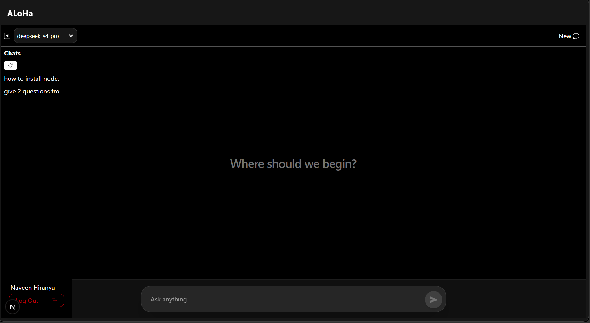

# Heading 1 AI Chat Application

I wanted to explore how modern AI-powered applications are built using Next.js and AI APIs.
What started as a simple chatbot evolved into a multi-model AI chat application with authentication, persistent chat history, and a clean user experience.

## ALoHa V1
### 📌 Features
- Multimodels support
- Modern chat interface
- Chat history
- New chat creation
- Like & Dislike responses
- One-click copy responses
- Basic email & password Sign In/ Sign Up
- Clean and responsive UI

## Getting Started
---
git clone https://github.com/NaveenHiranya/ai-chat-agent 
cd <project-name>
---

### Install dependencies
---
npm install
---

### Create a .env.local file
---
MONGODB_URI = your_mongodb_connection_string 
NVIDIA_API_KEY = your_nvidia_api_key
---

### Run the development server
---
npm run dev
---

#### Open http://localhost:3000 in your browser.

## Contributions
Contributions, suggestions, and feedback are always welcome.
Feel free to fork the project and create a pull request.

## License
This project is licensed under the MIT License. See the [LICENSE](LICENSE) file for details.

